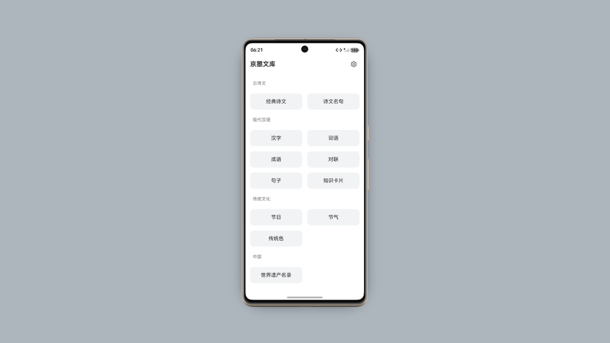

# 京墨文库（鸿蒙版）

[京墨文库](https://github.com/hefengbao/jingmo) 开源的中华文化阅读 APP，诗（词）文（名句）、汉字、成语、词语、歇后语、绕口令、传统节日、传统色、节气、人物等。

## 仓库

Github:[https://github.com/hefengbao/jingmo-for-HarmonyOS](https://github.com/hefengbao/jingmo-for-HarmonyOS)

Gitee:[https://gitee.com/hefengbao/jingmo-for-HarmonyOS](https://gitee.com/hefengbao/jingmo-for-HarmonyOS)

## 赞助

## 参考

### 架构

参考官方入门教程 [应用架构设计基础——三层架构](https://developer.huawei.com/consumer/cn/codelabsPortal/carddetails/tutorials_Next-BasicArchitectureDesignPart2)
搭建。

### 资源

[HarmonyOS图标库](https://developer.huawei.com/consumer/cn/design/harmonyos-icon/)
（发现点击左边的分类导航（靠后的分类）后不能正常显示图标，重新刷新页面，拖动页面向下滚动到可以显示出来😓）

## Github Star History

